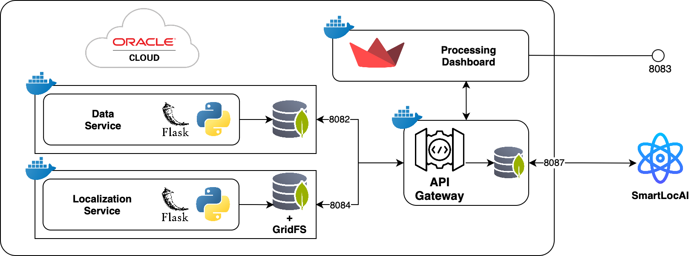

# SmartLocAI - Processing Dashboard

## Overview


The **Processing Dashboard** is an interactive platform developed with **Streamlit** that manages the entire workflow for indoor localization, from the acquisition and preprocessing of RSSI data, to the training of machine learning models, all the way to predicting the position of mobile devices. This solution leverages advanced techniques such as **Generative AI**, **K-Means clustering**, **K-Nearest Neighbors (KNN)**, and **trilateration** to obtain accurate position estimates based on Wi-Fi and BLE signals.

## a) System Architecture



The system architecture is modular and comprises the following key components:

- **CTGAN**: Based on a **Generative Adversarial Network** architecture, it is used to generate synthetic data from real datasets, enhancing the available data to improve the performance of localization models.
- **K-Means and KNN**: Algorithms used for data clustering and classification. K-Means organizes the data into clusters, while KNN is used to estimate the position of the devices.
- **SmartLocAI Mobile App**: Collects RSSI data from Wi-Fi access points and BLE beacons through mobile devices. It sends the data to the **DataService API** for processing.
- **DataService API**: Handles the collection, storage, and preprocessing of the data.
- **LocalizationService API**: Manages the deployment and execution of trained models, returning the estimated position based on the incoming RSSI data.
- **Preprocessing Dashboard (Streamlit)**: Interface that allows for data visualization and preprocessing operations, model training, and deployment management.

## b) Component Repositories

- **SmartLocAI Mobile App**: [Repository](https://github.com/UniSalento-IDALab-IoTCourse-2023-2024/wot-project-2023-2024-SmartLocAI_APP-IzziBarone.git)
- **DataService API**: [Repository](https://github.com/UniSalento-IDALab-IoTCourse-2023-2024/wot-project-2023-2024-DataService-IzziBarone.git)
- **LocalizationService API**: [Repository](https://github.com/UniSalento-IDALab-IoTCourse-2023-2024/wot-project-2023-2024-LocalizationService-IzziBarone)
- **Preprocessing Dashboard**: This current repository describes the main interface for managing the entire preprocessing, training, and deployment workflow.

## c) Dashboard Description

The **Processing Dashboard** is the operational core of the solution, integrating and orchestrating all system components. The Dashboard allows you to:

1. **Visualize and Preprocess Data**: The data collected from mobile devices is displayed in real-time with statistics and interactive charts. You can perform data cleaning, aggregation, and normalization operations.
   
2. **Generate Synthetic Data with CTGAN**: If the dataset is limited, you can use the **Data Augmentation** module based on **CTGAN** to expand the available data and improve model training.

3. **Train Models**:
   - **K-Means**: RSSI data clustering.
   - **KNN**: Trained on each cluster to ensure accurate predictions. The dashboard includes an automatic **k** parameter optimization module to improve model precision.

4. **Deploy Models**: Once training is complete, the K-Means and KNN models can be deployed through the **LocalizationService API**, ensuring that the most recent models are used for real-time predictions.

5. **Monitor and Visualize Results**: The dashboard provides visualization tools to monitor model performance, such as 3D charts for K-Means clusters and accuracy metrics for KNN models.

---

### How to start?

1. Clone repository:
   ```bash
   git clone https://github.com/fizzi01/SmartLocAI.git
   ```

2. Settings.yml:
   ```yml
   credentials:
     usernames:
       [USERNAME]:
         email: ...
         name: ...
         password: [HASHED_PASSWORD]
   cookie:
     expiry_days: 30
     key: [HASHED_KEY]
     name: [HASHED_NAME]
   preauthorized:
     emails:
     - [EMAILS]
   api:
     data: http://****:8087/data
     test_data: http://****:8087/data/test
     models_upload: http://****:8087/models/upload
     login: http://*****:8087/login
   save_dirs:
     data: "data"
     models: "models"
     knn: "knn"
     kmeans: "kmeans"
     ctgan: "ctgan"
   ```
3. Credential and Key Generation:
   ```python
   import streamlit_authenticator as stauth

   hashed_passwords = stauth.Hasher(["......."]).generate()
   print(hashed_passwords)
   ```

5. Dependencies:
   ```bash
   docker compose up -d
   ```
